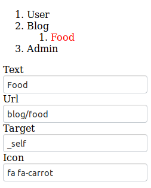

+++
title = "Vue Menu Editor"
description = "A drag and drop menu editor built with vue"
date = 2019-02-14
+++

A drag and drop menu editor built with vue.
### Usage
Reorder menu items on the frontend by dragging and dropping them to their desired place.

Embeed menu items under other items to the maximum depth of ten.

Click on a menu item to edit it's properties.

### Style
It's intentionally ustyled (mostly, see todo).
This provides the most flexibility to you when you consider including it in your project.

### Todo
* Remove dependency on element-ui
* Remove red color on active element
* Provide an optional default style and a demo page
* Pass data back to parent document